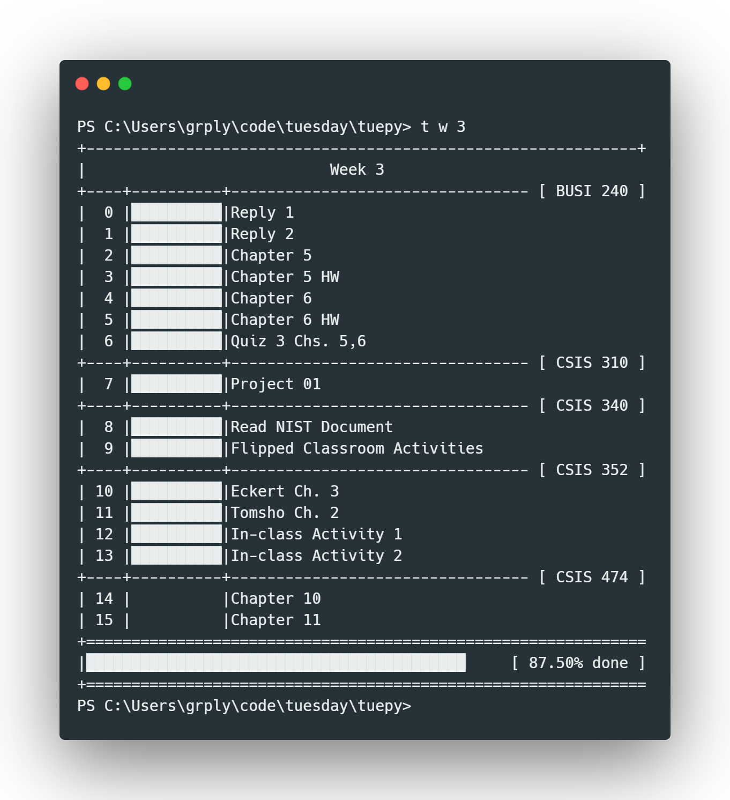

<h1 align="center">
  Tuesday
</h1>

<h3 align="center">A command-line task manager and course workload manager inspired by student woes, insufficient funds, hard limits on only 24 hour days, and monday.com</h3>



<p align="center">
  <a href="#key-features" style="color: red; padding-left: 10px; padding-right: 10px; padding-top: 5px; padding-bottom: 5px; border-radius: 3px; background-color: white; box-shadow: 0px 0px 5px 0px rgba(0,0,0,0.75);">Key Features</a> •
  <a href="#install">Install</a> •
  <a href="#develop">Develop</a> •
  <a href="#examples">Examples</a> •
  <a href="#contributing">Contributing</a> •
  <a href="#credits">Credits</a> •
  <a href="#license">License</a>
</p>


## Key Features
* **Manage grouped tasks in your work week

* **Get Task and Week-Level Progress Indicators**
    * Way more realistic and and fun than just checking a box
* **Simple**
    * Data is store as `.csv` in your home director`
    * Zero configuration

## Requirements

* Python 3
* pip

## Install

```
git clone https://github.com/grplyler/tuepy.git
cd tuepy
python3 setup.py install
```

## Develop

```
git clone https://github.com/grplyler/tuepy.git
cd tuepy
python3 setup.py develop
```

## Examples


**Get summary of week 3**
```
t w 3
```

**Get summary of current week**
```
t
```

**Add a new task to a group**

Format: `group:week:task:percentage:type`

```
t a CSIS 310:4:Develop Portfolio Site:0:assignment
```

*Output*
```
Added ['CSIS 310', '4', 'Develop Portfolio Site', '0', 'assignment']
```

**Setting task progressing**

*Sets task id 21 to 50%*

```
t 21 50
```

## Rationale

I wrote this little tool to accomplish the following goals
* Learn Rust
* Have very simple recon intrusion detection without having to install something heavier like `snort` or the like.
* Explore Packets at the Layer 2 Level (For my Major in Networking & Security)

## Disclaimer

The code and executables in this project are a **work in progress**. While they can be used an tools/toys and what have you, they are not production ready and **shouldn't be used on crital systems** without understanding these disclaimers. 


## Contributing

If you like this project, here are some ways you can contribute!

* Feature Requests
* Bug Reports (Although writing in Rust means significantly less bugs)
* Platform Testing


## Credits

This software uses the following open source and free tools:

- [Carbon](http://carbon.now.sh) (Code Screenshots)

## License

MIT


